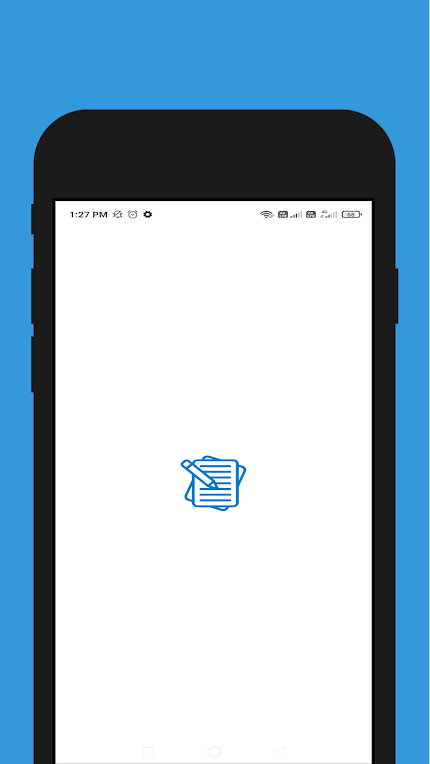
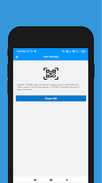
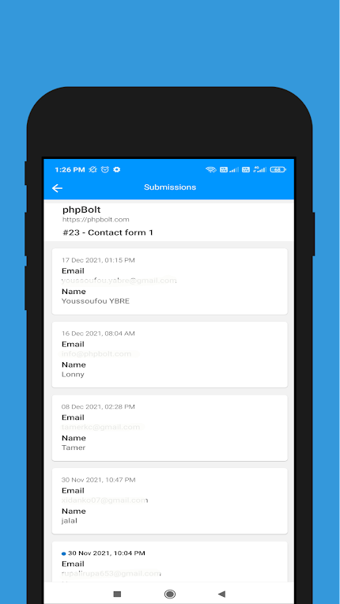

### Access CFDB7 Data From APP ###

Install **CFDB7 database** and **Connector** Plugin.

Then go to Wrodpress > wp-admin > Contact Forms > Connector.

### Instll CFDB7 Connector Plugin ###
Download CFDB7 database and connector plugin.
1. [Download CFDB7 Database Plugin](https://downloads.wordpress.org/plugin/contact-form-cfdb7.zip)
2. [Download Connector Plugin](https://codeload.github.com/arshidkv12/cfdb7-connector/zip/refs/heads/main)

Settings > Add web > Scan QR code (From APP).

  
  
  

## Download Android/iOS application

  

  

[Download Android App](https://play.google.com/store/apps/details?id=com.cfdb7)

[Download iOS App](https://apps.apple.com/app/id1601823333)
